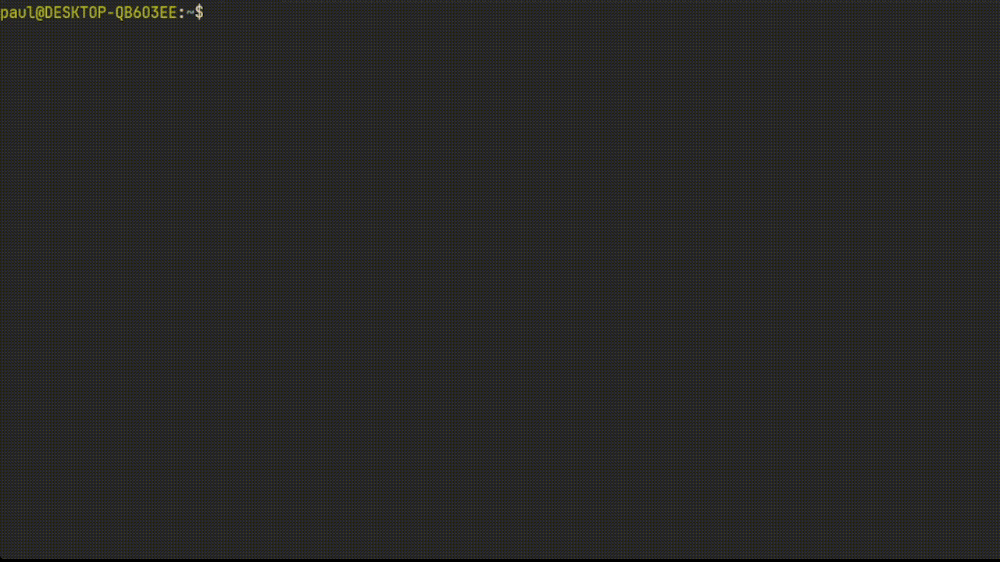
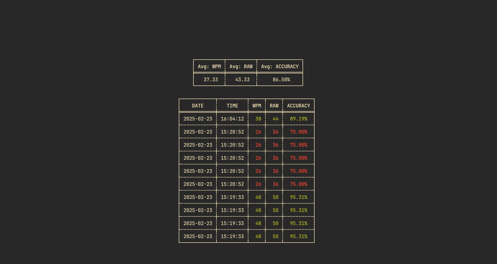

<div align="center">
  <pre>
,--------.,--.   ,--.,------.,--.   ,--.  
'--.  .--' \  `.'  / |  .--. '\  `.'  /  
   |  |     '.    /  |  '--' | '.    /   
   |  |       |  |   |  | --'    |  |    
   `--'       `--'   `--'        `--'    
  </pre>
</div>

> [!WARNING]  
> When the terminal is too small it can lead to strange behavior.

## Table of contents
- [Overview](#overview)
- [Installation](#installation)
- [Usage](#usage)
- [Keybindings](#keybindings)
- [Flags](#flags)
- [Configuration](#configuration)
- [Themes](#themes)
- [Cursor](#cursor)
- [Stats](#stats)
- [Language](#language)
- [Uninstall](#uninstall)

## Overview


I wanted a simple typing game to improve my typing speed and accuracy. I really like using
[monkeytype](https://monkeytype.com/), so I built something similar for the terminal. Typy is a
terminal typing test built with [ratatui](https://ratatui.rs/): it shows a stream of random words,
tracks your speed and accuracy, and plots your words-per-minute over the run.

The app is fully interactive:

- a **home screen** to start a test,
- a **settings page** (theme, cursor, language, mode, time) with dropdown menus,
- a **results screen** with WPM / accuracy and a graph,
- a **stats page** with your recent games and averages.

It also supports different modes (`uppercase`, `punctuation`), multiple languages, and themeable
colors.

## Installation
To install Typy, you can use the [Cargo] package manager:

[Cargo]: https://doc.rust-lang.org/cargo/

```bash
cargo install --git "https://github.com/Pazl27/typy-cli.git"
```

If you prefer to get the newest version and compile it yourself, follow these steps:

1. Clone the Typy repository:
    ```bash
    git clone https://github.com/Pazl27/typy-cli.git
    cd typy-cli
    ```

2. Compile the project:
    ```bash
    cargo build --release
    ```

3. Move the compiled binary to a directory in your PATH:
    ```bash
    sudo mv target/release/typy /usr/local/bin/
    ```

4. Ensure the `english.txt` file is in the correct location:
    ```bash
    mkdir -p ~/.local/share/typy
    cp resources/lang/english.txt ~/.local/share/typy/
    ```

If you have Nix with flakes enabled, you can install typy-cli directly:

```bash
nix profile install github:Pazl27/typy-cli
```

Or to run without installing:

```bash
nix run github:Pazl27/typy-cli
```

## Usage
Run `typy` with no arguments to open the interactive app. You start on the home screen, from where
you can begin a test, open the settings, or view your stats.

```bash
typy
```

If you pass a game option (`-t` or `-m`), Typy skips the home screen, runs a single test right away,
shows the results, and exits when you press a key — handy for a quick run:

```bash
typy -t 60 -m punctuation
```

## Keybindings

**Home**

| Key           | Action              |
| ------------- | ------------------- |
| any key       | start a test        |
| `s`           | open settings       |
| `p`           | open stats          |
| `q` / `Esc`   | quit                |

**Typing**

| Key            | Action                                    |
| -------------- | ----------------------------------------- |
| letters        | type the word                             |
| `Space`        | jump to the start of the next word        |
| `Backspace`    | delete the last character                 |
| `Esc`          | cancel (back to home, or quit in quick run) |

**Results / Stats / Settings**

| Key                 | Action                                    |
| ------------------- | ----------------------------------------- |
| any key (results)   | restart, or exit in quick run             |
| `Esc` / `q`         | back                                      |
| `j` / `k` (settings)| move between rows / dropdown options      |
| `Enter` (settings)  | open a dropdown / confirm a selection     |

`Ctrl + c` quits from anywhere.

## Flags
The `typy` application supports the following flags:

- `-t, --time <SECONDS>`: Duration of the test in seconds. Runs a single test immediately and exits.
  - e.g., `typy -t 60` runs a 60 second test.

- `-m, --mode <MODE>...`: Mode(s) to play. Runs a single test immediately.
  - possible modes are `normal`, `uppercase` and `punctuation`.
  - e.g., `typy -m uppercase punctuation`.

- `-s, --stats`: Show statistics for your past games.

- `-c, --config`: Create the config file if it doesn't exist and open it in `$EDITOR`.

Run `typy --help` for the full help with usage examples.

## Configuration
Typy is configured via a TOML file located at `~/.config/typy/config.toml`. You can edit it directly
or open it with `typy -c`. Everything below can also be changed live from the in-app settings page
(`s` on the home screen), which writes your choices back to this file.

```toml
# ~/.config/typy/config.toml

theme = "Catppuccin Mocha"   # name of a built-in or custom theme (see Themes)
cursor = "block"             # caret style (see Cursor)

[modes]
default_mode = "normal"      # "normal" | "uppercase" | "punctuation", or a combination e.g. "uppercase, punctuation"
uppercase_chance = "0.3"     # 0.0–1.0, clamped
punctuation_chance = "0.5"   # 0.0–1.0, clamped

[language]
lang = "english"             # word list to use (see Language)

[game]
time = 30                    # default test duration in seconds
```

## Themes
A theme is selected by name with the top-level `theme` key. Typy ships with several built-in themes:

- `Catppuccin Mocha` (default)
- `Gruvbox Dark`
- `Dracula`
- `Nord`
- `Tokyo Night`
- `Solarized Dark`
- `One Dark`
- `Rosé Pine`

You can pick one from the settings page, or set it directly:

```toml
theme = "Nord"
```

### Custom themes
To define your own themes, create `~/.config/typy/theme.toml` (next to `config.toml`). Each table is
one theme; its display name is the `name` field (falling back to the table key). Custom themes appear
in the settings dropdown alongside the built-ins and override a built-in with the same name.

```toml
# ~/.config/typy/theme.toml

[neon]
name = "Neon Dream"
fg = "#ffffff"
missing = "#555555"
error = "#ff0044"
accent = "#00ffcc"
graph_data = "#00ffcc"    # optional; graph_* fall back to sensible defaults
graph_title = "#ff00ff"
graph_axis = "#333333"
```

Then select it:

```toml
theme = "Neon Dream"
```

Colors are `#rrggbb` hex values. `fg` is correct text, `missing` is untyped text, `error` is
mistakes, and `accent` is the highlight color; `graph_data`, `graph_title` and `graph_axis` color the
results graph.

## Cursor
The typing caret uses your terminal's cursor. Set its style with the `cursor` key (or from settings):

```toml
cursor = "bar"
```

Possible values: `block`, `underline`, `bar`, and their blinking variants `blinking block`,
`blinking underline`, `blinking bar`.

## Stats
Your results are saved to `~/.local/share/typy/scores.json`, which keeps your last 10 games plus the
running averages for WPM, RAW and accuracy.

You can view them in two ways:

- In the app: press `p` on the home screen.
- From the terminal: `typy -s`.



Press `Esc` or `q` to close the view.

## Language
Word lists live in `~/.local/share/typy/` as `<language>.txt` files. The repository ships several
languages under `resources/lang/` (`english`, `german`, `french`, `italian`, `romanian`, `russian`,
`spanish`).

### How word lists are fetched
> [!IMPORTANT]
> `cargo install` only installs the `typy` binary — it does **not** copy any language files to your
> machine. The word lists are fetched **on demand, over the network**.

When you use a language for the first time, Typy looks for `~/.local/share/typy/<language>.txt`. If
it isn't there, it **downloads that one file** from GitHub
(`raw.githubusercontent.com/Pazl27/typy-cli/.../resources/lang/<language>.txt`) and saves it locally.
From then on it's read from disk and no network access is needed.

What this means in practice:

- The **first run needs an internet connection** (to fetch at least `english`). If GitHub is
  unreachable, starting a test will fail with a download error.
- Only the language you actually use is downloaded, not all of them.
- Downloads always come from the `master` branch, regardless of the installed version/tag.
- **Themes** are the exception — they are compiled into the binary and are always available offline.
- The **Nix** package bundles `english.txt` and installs it on first launch, so Nix users work
  offline out of the box.

To use Typy fully offline (or to pre-seed languages), copy the files yourself:

```bash
mkdir -p ~/.local/share/typy
cp resources/lang/*.txt ~/.local/share/typy/   # from a cloned repo
```

Every `.txt` file found in `~/.local/share/typy/` is listed in the settings language dropdown — just
pick one. You can also set it in the config:

```toml
[language]
lang = "german"
```

To add your own language, drop a file in `~/.local/share/typy/` with one word per line:

```txt
word1
word2
...
```

Name it after the language (without the `.txt` extension). It will then show up in the settings
dropdown. Pull requests adding new languages to the repository are welcome.

## Uninstall
```bash
cargo uninstall typy
```
